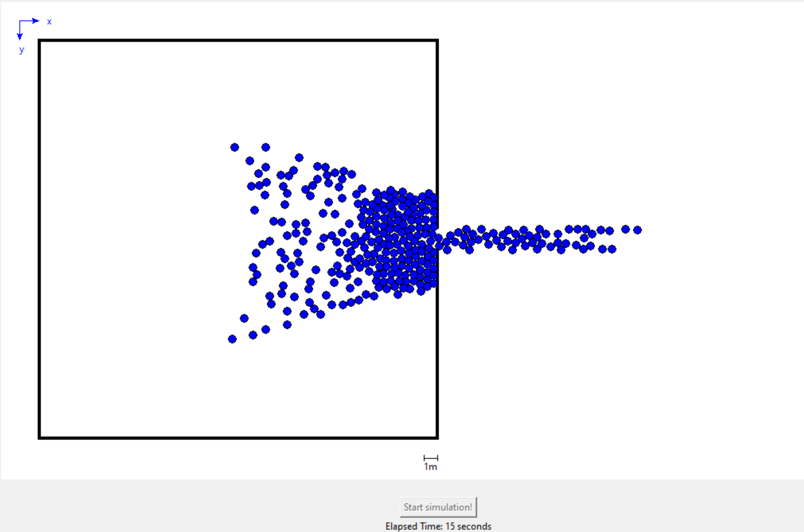

# Crowd Dynamics Simulation

## Project description
This repository contains C code for simulating the movement of individuals in a closed area. The simulation includes forces that drive the individual towards an exit door while avoiding collisions with each other and the room walls.



## Project structure
[code/](./code) : This folder contains the program code

[bin/](./bin) : This folder contains the library created after compiling C code

[versioning/](./versioning) : This folder contains all the past version, and different implmentation tried (as object avoidance for example)

## Implementation
* The calculation of the position is done by C and is then given to Python via a shared library that can be used by the `ctypes` module.
* Python actually renders the simulation with the use of `tkinter`
* A matric of coordinate x and y is passed from C to Python

## Instruction
You can view the simulation by simply running the Python code. It will actually :
* Compile the C code into a `.so` library (stored in : [bin/](./bin))
* Directly run the simulation once it's done

You can modify the default parameter in the asked field of the GUI at the beginning to simulate different crowd in different room sizes.

## Requirements
As we use C and Python the two languages should be installed.
The code requires no further instalation as `tkinter` is usually by default installed with python.

The version used are the following :

```
$ python --version
Python 3.11.5

$ gcc --version
gcc.exe (Rev2, Built by MSYS2 project) 13.2.0
```

But it should work with any above versions.


## Parameters that can be modified by the user

### Simulation Parameters

- **Number of Individuals:** The total number of individuals in the simulation.

- **Individual Type:** The type of individuals in the simulation (e.g., Human, Cow, Ant, Sheep, Elephant). This modifies the radius of the individuals.

- **Individual Speed:** The delay between each move of an individual in milliseconds (refreshrate of the canva).

### Room Configuration

- **Room Width and Height:** The dimensions of the simulated room in meters.

- **Exit Type:** The type of exit in the room (e.g., Standard door, Double door, Ant nest hole, Paddock gate).

- **Wall for Exit:** The wall on which the exit is located (e.g., Right, Left, Top, Bottom).

- **Exit Coordinates:** The position along the chosen wall where the exit is located.